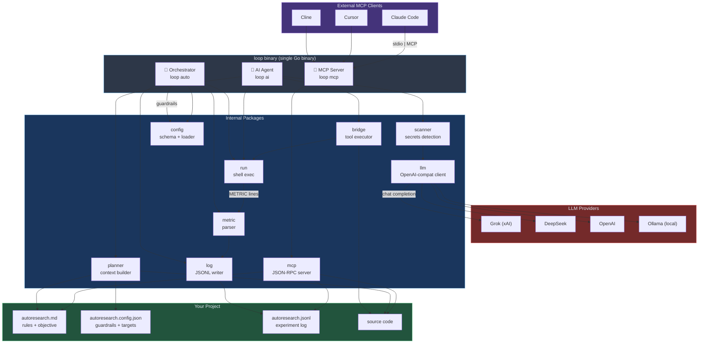
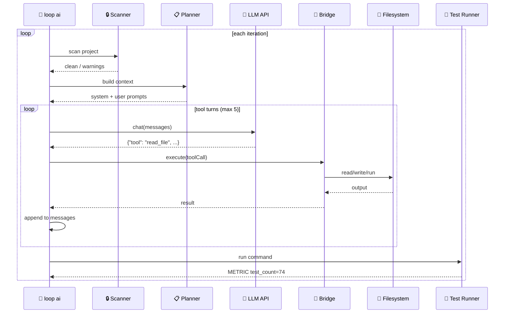
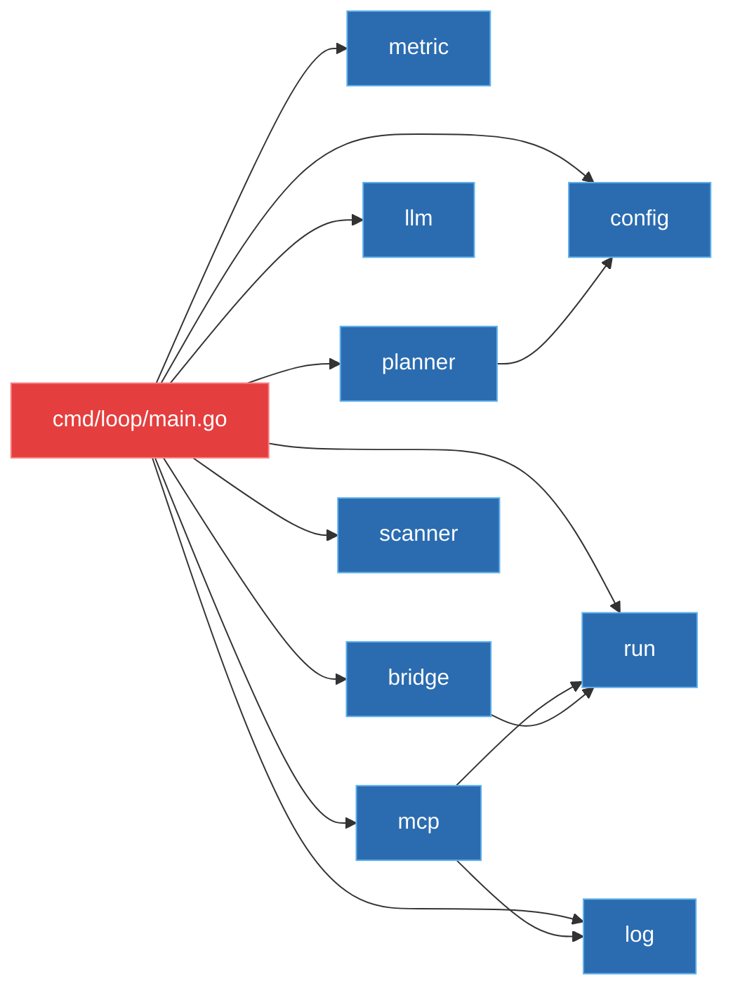

# Loop Engineering — Autonomous AI Coding Agent

## What is Loop Engineering?
A **Go CLI tool** that serves as both:
1. **MCP Server** 🧩 — exposes tools (`read_file`, `write_file`, `run_command`, etc.) for any MCP-compatible LLM client (Claude Code, Cursor, Cline)
2. **Self-contained AI Agent** 🤖 — built-in LLM client that reads your project, plans changes, writes code, runs tests, and iterates autonomously

Zero external dependencies. Single binary. Works with Grok, DeepSeek, OpenAI, or local Ollama.

## Architecture



### How `loop ai` works (inner loop)



### Metric types

| Type | Who checks | Example |
|------|-----------|---------|
| **Guardrail** (soft) | `loop auto` every run | `exit_code == 0` |
| **Qualitative** (human) | LLM uses judgment | “UI is clean” |
| **Hard** (numeric) | `loop auto` termination | `test_count >= 74` |

### Package dependency graph



## Quick Start

### 1. Build
```bash
go build -o loop ./cmd/loop/
```

### 2. MCP Server Mode (works with any LLM client)
```bash
# Start MCP server via stdio
./loop mcp
```
Then connect your LLM client:
- **Claude Code**: `claude mcp add -- stdio -- /path/to/loop mcp`
- **Cursor**: Configure as custom MCP server
- **Cline**: Add as MCP tool server

Exposed tools:
| Tool | Description |
|------|-------------|
| `read_file` | Read files with offset/limit |
| `write_file` | Write/create files |
| `run_command` | Execute shell commands |
| `list_files` | List project files |
| `read_config` | Read experiment config |
| `get_metrics` | Get test/benchmark results |
| `check_termination` | Check if goals met |

### 3. Self-contained AI Agent Mode
```bash
# With Grok (default)
./loop ai --api-key xai-...

# With DeepSeek
./loop ai --provider deepseek --api-key sk-...

# With local Ollama
./loop ai --provider ollama

# Configure in autoresearch.config.json:
# "ai": { "provider": { "provider": "grok", "model": "grok-4-20-0309-reasoning" } }
# Or set LOOP_API_KEY env var
```

### 4. Experiment Loop Mode
```bash
# Manual experiment
./loop run "go test ./..."

# Autonomous iteration from config
./loop auto
```

## Commands

| Command | Purpose |
|---------|---------|
| `loop mcp` | MCP server — tools for any LLM client |
| `loop ai` | Self-contained AI agent (OODA loop) |
| `loop run` | Execute command with timing |
| `loop auto` | Autonomous experiment iteration |
| `loop bench` | Run Go benchmarks as METRIC lines |
| `loop check` | Validate project state |
| `loop init` | Initialize experiment session |
| `loop version` | Print version |

## Security
Before any file content is sent to a cloud LLM API, the **security scanner** runs:
- Detects API keys, passwords, tokens, private keys
- Flags `.env`, `*.pem`, `secrets.*` files
- Warns and asks confirmation on critical findings

## Configuration

### `autoresearch.config.json`
```json
{
  "metricName": "test_count",
  "direction": "higher",
  "command": "go test ./...",
  "maxIterations": 50,
  "termination": {
    "conditions": [
      { "metric": "test_count", "operator": ">=", "value": 50 }
    ]
  },
  "ai": {
    "maxIterations": 10,
    "filesInScope": ["*.go", "*.ts"],
    "provider": {
      "provider": "grok",
      "model": "grok-4-20-0309-reasoning",
      "endpoint": "https://api.x.ai/v1",
      "apiKey": ""
    }
  }
}
```

### `autoresearch.md`
Defines the project objective, rules, and metrics for the AI agent.

## Supported LLM Providers

| Provider | Flag | Env Var | Default Model |
|----------|------|---------|---------------|
| Grok (xAI) | `--provider grok` | `LOOP_API_KEY` | `grok-4-20-0309-reasoning` |
| DeepSeek | `--provider deepseek` | `LOOP_API_KEY` | `deepseek-v4-flash` |
| OpenAI | `--provider openai` | `LOOP_API_KEY` | `gpt-4o` |
| Ollama (local) | `--provider ollama` | — | `gemma4-hermes` |

## Example Projects
See `examples/` for industry-specific Go demos:
- Fintech payment processing
- Healthcare search
- E-commerce catalog
- DevOps log parsing
- Media thumbnail
- Logistics route optimization

## License
MIT
