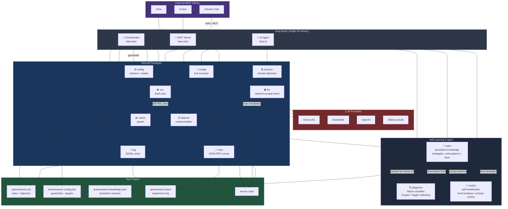
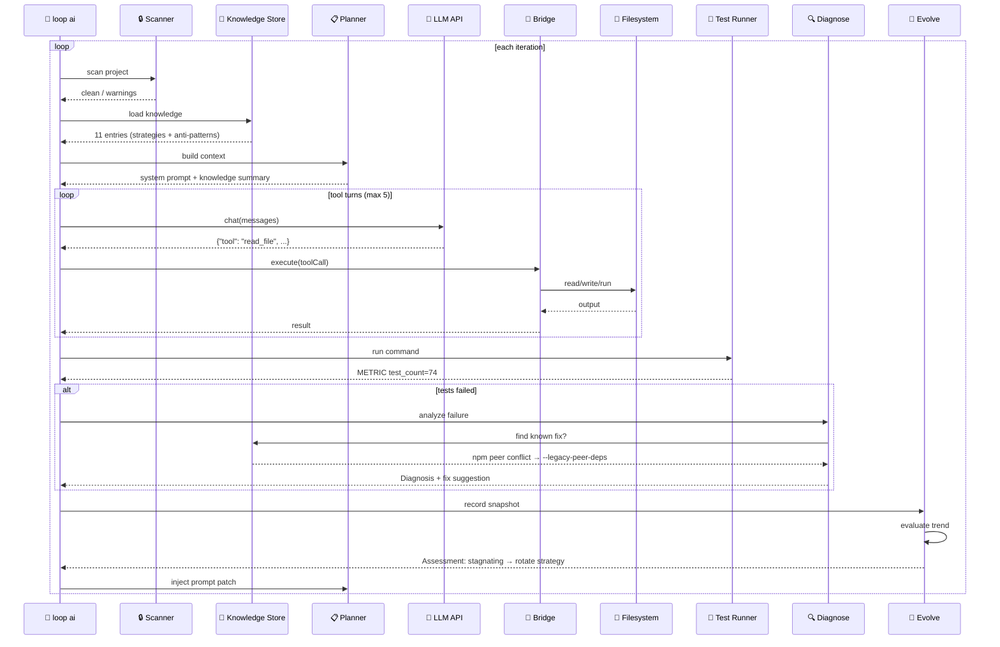
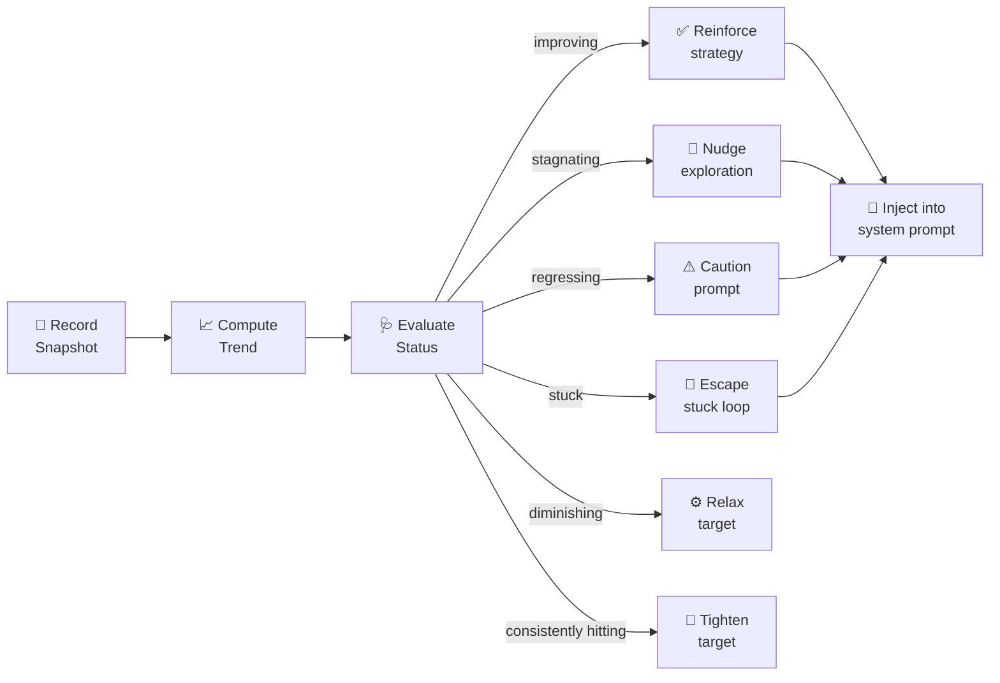
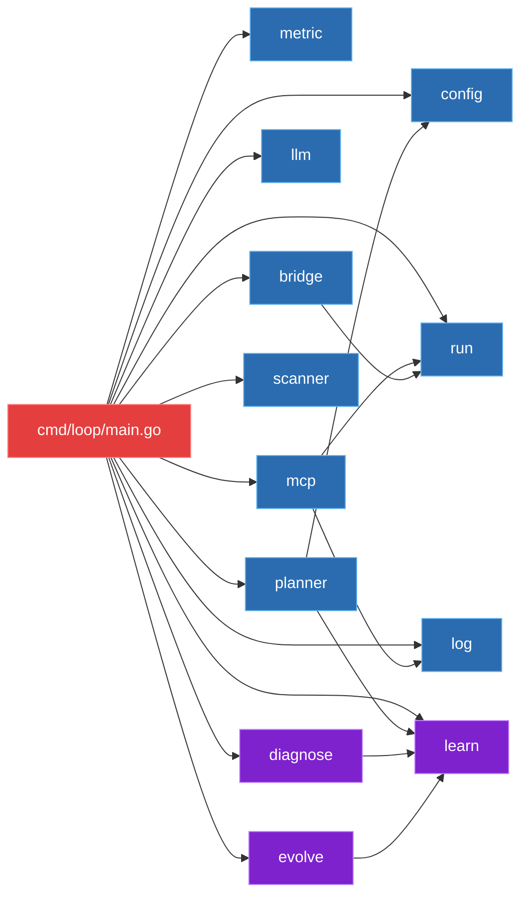

# Loop Engineering — Autonomous AI Coding Agent

## What is Loop Engineering?
A **Go CLI tool** that serves as both:
1. **MCP Server** 🧩 — exposes tools (`read_file`, `write_file`, `run_command`, etc.) for any MCP-compatible LLM client (Claude Code, Cursor, Cline)
2. **Self-contained AI Agent** 🤖 — built-in LLM client that reads your project, plans changes, writes code, runs tests, iterates autonomously

Zero external dependencies. Single binary. Works with Grok, DeepSeek, OpenAI, or local Ollama.

## The Full Self-Learning Stack (v1.4)

```
┌──────────────────────────────────────────────────────────────────────┐
│                       loop (single Go binary)                        │
│                                                                      │
│  ┌──────────┐   ┌───────────┐   ┌───────────┐   ┌───────────┐      │
│  │  learn/  │   │ diagnose/ │   │  evolve/  │   │  planner/ │      │
│  │ Memory   │◄──┤ Classify  │◄──┤ Self-tune │──►│ Prompt    │      │
│  │ persists │   │ failures  │   │ strategy  │   │ builder   │      │
│  └────┬─────┘   └─────┬─────┘   └─────┬─────┘   └─────┬─────┘      │
│       │               │               │               │             │
│       │  remembers fix if seen before │               │             │
│       │◄──────────────────────────────┘               │             │
│       │                                              │             │
│       │      best strategies + anti-patterns         │             │
│       │─────────────────────────────────────────────►│             │
│       │                                              │             │
│       │      prompt patches (reinforce/explore)      │             │
│       │◄─────────────────────────────────────────────┘             │
│                                                                      │
│  Packages: 12 internal (all pure Go, zero external deps)             │
│  Storage:  autoresearch.knowledge.json (persistent memory)           │
└──────────────────────────────────────────────────────────────────────┘
```

## Architecture



### How `loop ai` works with the self-learning stack



### How `evolve` self-modifies



### Failure Diagnosis Engine

| Category | Example Trigger | Known Fix Source |
|----------|----------------|------------------|
| `dep_missing` | `Module not found`, `cannot find package` | Memory store — install command |
| `dep_conflict` | `peer dependency conflict`, `ERESOLVE` | Memory store — `--legacy-peer-deps` |
| `build_error` | `syntax error`, `undefined:`, `import cycle` | LLM — fix source code |
| `test_failure` | `FAIL`, `assertion failed` | LLM — fix test or code |
| `config_error` | `config:`, `invalid config` | Suggest `loop init` |
| `env_issue` | `permission denied`, `command not found` (system tool) | Check PATH, permissions |
| `network_error` | `connection refused`, `DNS`, `timeout` | Retry, check connectivity |
| `code_bug` | Panic, nil pointer, index out of range | LLM — fix the bug |
| `unknown` | Unrecognized pattern | Full output to LLM + store |

### Knowledge Store (`autoresearch.knowledge.json`)

| Entry Type | Purpose | Example |
|-----------|---------|---------|
| `strategy` | Proven techniques that worked | "Add test stubs for untested modules" |
| `anti_pattern` | Approaches that consistently fail | "Rewrite entire module at once" |
| `infra_fix` | Environment/dependency fixes | "npm install --legacy-peer-deps" |

Automatic distillation from JSONL logs: `loop learn --distill`

### Metric types

| Type | Who checks | Example |
|------|-----------|---------|
| **Guardrail** (soft) | `loop auto` every run | `exit_code == 0` |
| **Qualitative** (human) | LLM uses judgment | "UI is clean" |
| **Hard** (numeric) | `loop auto` termination | `test_count >= 74` |

### Package dependency graph



## Quick Start

### 1. Build
```bash
go build -o loop ./cmd/loop/
```

### 2. MCP Server Mode (works with any LLM client)
```bash
# Start MCP server via stdio
./loop mcp
```
Then connect your LLM client:
- **Claude Code**: `claude mcp add -- stdio -- /path/to/loop mcp`
- **Cursor**: Configure as custom MCP server
- **Cline**: Add as MCP tool server

Exposed tools:
| Tool | Description |
|------|-------------|
| `read_file` | Read files with offset/limit |
| `write_file` | Write/create files |
| `run_command` | Execute shell commands |
| `list_files` | List project files |
| `read_config` | Read experiment config |
| `get_metrics` | Get test/benchmark results |
| `check_termination` | Check if goals met |

### 3. Self-contained AI Agent Mode
```bash
# With Grok (default)
./loop ai --api-key xai-...

# With DeepSeek
./loop ai --provider deepseek --api-key sk-...

# With local Ollama
./loop ai --provider ollama

# Configure in autoresearch.config.json:
# "ai": { "provider": { "provider": "grok", "model": "grok-4-20-0309-reasoning" } }
# Or set LOOP_API_KEY env var
```

### 4. Experiment Loop Mode
```bash
# Manual experiment
./loop run "go test ./..."

# Autonomous iteration from config
./loop auto
```

## Commands

| Command | Purpose |
|---------|---------|
| `loop mcp` | MCP server — tools for any LLM client |
| `loop ai` | Self-contained AI agent with full self-learning stack |
| `loop run` | Execute command with timing |
| `loop auto` | Autonomous experiment iteration |
| `loop bench` | Run Go benchmarks as METRIC lines |
| `loop check` | Validate project state |
| `loop learn` | Knowledge store management (`--distill`, `--anti`, `--infra`) |
| `loop init` | Initialize experiment session |
| `loop version` | Print version |

## Self-Learning Capabilities

### 🧠 Persistent Memory (`learn/` — v1.3.0)
- Distills patterns from experiment logs (`loop learn --distill`)
- Tracks strategy confidence scores
- Maintains anti-pattern blacklist
- Stores infrastructure fixes with trigger matching

### 🔍 Failure Diagnosis (`diagnose/` — v1.3.1)
- Classifies 8 failure categories (dep_missing, dep_conflict, build_error, test_failure, config_error, env_issue, network_error, code_bug, unknown)
- Pattern matchers for npm, Go, Python, and shell errors
- Queries knowledge store for known fixes (e.g., `--legacy-peer-deps` for npm conflicts)
- Auto-feeds diagnosis back to LLM on test failures

### 🧬 Self-Evolution (`evolve/` — v1.4.0)
- Records performance snapshots every iteration
- Detects trends: improving / stagnating / regressing / stuck
- Generates prompt patches: reinforce, explore, caution, escape
- Auto-tunes config targets (tighten if hitting, relax if stuck)
- Detects diminishing returns and stuck loops
- Suggests strategy rotation from knowledge store

## Security
Before any file content is sent to a cloud LLM API, the **security scanner** runs:
- Detects API keys, passwords, tokens, private keys
- Flags `.env`, `*.pem`, `secrets.*` files
- Warns and asks confirmation on critical findings

## Configuration

### `autoresearch.config.json`
```json
{
  "metricName": "test_count",
  "direction": "higher",
  "command": "go test ./...",
  "maxIterations": 50,
  "termination": {
    "conditions": [
      { "metric": "test_count", "operator": ">=", "value": 50 }
    ]
  },
  "ai": {
    "maxIterations": 10,
    "filesInScope": ["*.go", "*.ts"],
    "provider": {
      "provider": "grok",
      "model": "grok-4-20-0309-reasoning",
      "endpoint": "https://api.x.ai/v1",
      "apiKey": ""
    }
  },
  "objectives": ["improve test coverage", "optimize performance"],
  "guardrails": [
    { "check": "exit_code == 0" }
  ]
}
```

### `autoresearch.md`
Defines the project objective, rules, and metrics for the AI agent.

### `autoresearch.knowledge.json` (auto-generated)
Persistent memory — stores strategies, anti-patterns, and infrastructure fixes across sessions.

## Supported LLM Providers

| Provider | Flag | Env Var | Default Model |
|----------|------|---------|---------------|
| Grok (xAI) | `--provider grok` | `LOOP_API_KEY` | `grok-4-20-0309-reasoning` |
| DeepSeek | `--provider deepseek` | `LOOP_API_KEY` | `deepseek-v4-flash` |
| OpenAI | `--provider openai` | `LOOP_API_KEY` | `gpt-4o` |
| Ollama (local) | `--provider ollama` | — | `gemma4-hermes` |

## Example Projects
See `examples/` for industry-specific Go demos:
- Fintech payment processing
- Healthcare search
- E-commerce catalog
- DevOps log parsing
- Media thumbnail
- Logistics route optimization

## Package Tree
```
cmd/loop/main.go          CLI dispatch + all commands
internal/bridge/bridge.go Tool execution (LLM → real actions)
internal/config/config.go Goal, Guardrail, HardMetric, AI schema
internal/diagnose/diagnose.go Failure classifier (8 types, 4 language matchers)
internal/evolve/evolve.go Self-modification engine (trends, prompt tuning, config tuning)
internal/learn/store.go   Persistent knowledge store (JSON)
internal/llm/llm.go       OpenAI-compatible client
internal/log/log.go       JSONL experiment logger
internal/mcp/mcp.go       MCP server (JSON-RPC 2.0)
internal/metric/metric.go METRIC parser
internal/patch/patch.go   Smart code patcher
internal/planner/planner.go System prompt + knowledge injection
internal/run/run.go       Shell command runner
internal/scanner/scanner.go Secrets detection
```

## License
MIT
